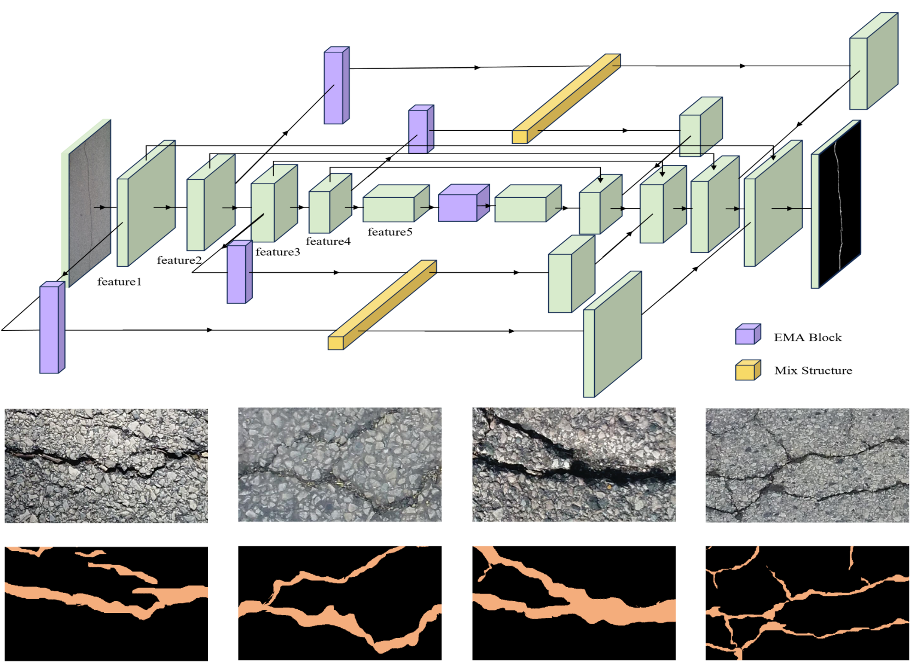

# Pavement damage detection

The project focuses on leveraging computer vision techniques to detect and classify road damages. The primary goal is to develop an automated system that can identify various types of road defects such as potholes, cracks, and surface wear from images or video footage captured by vehicles or drones. The approach involves training convolutional neural networks (CNNs) on annotated datasets to recognize patterns associated with different types of road damage.

By implementing advanced image processing algorithms and machine learning models, the system aims to provide accurate and real-time damage assessment. This can significantly improve maintenance planning and resource allocation, leading to safer and more efficient road infrastructure management.

