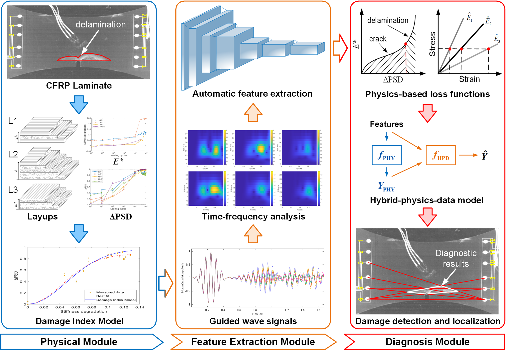

<html lang="en">
<head>
    <meta charset="UTF-8">
    <meta name="viewport" content="width=device-width, initial-scale=1.0">
    
    <title>Research</title>
</head>
<body>
    <h1>Research</h1>
    <h2>1. Multi-physics simulation for guided wave propagation in composite structures</h2>
    
Multi-physics simulation is utilized to develop finite element models of composite structures and ultrasonic guided wave active sensing systems for simulating the actuation, propagation and sensing of ultrasonic guided waves in anisotropic  materials. On this basis, the induction mechanism of typical failure modes at the microscale and the growth trend at the macroscale are investigated to design a damage injection method for exploring the propagation of ultrasonic guided waves in different damage states. In this way, by controlling the location and shape of the simulated damage areas, the run-to- failure data of composite structures can be obtained through simulation without expensive and labor-intensive accelerated aging tests.

  

    <h2>2. Pavement damage detection</h2>
    
The project focuses on leveraging computer vision techniques to detect and classify road damages. The primary goal is to develop an automated system that can identify various types of road defects such as potholes, cracks, and surface wear from images or video footage captured by vehicles or drones. The approach involves training convolutional neural networks (CNNs) on annotated datasets to recognize patterns associated with different types of road damage. By implementing advanced image processing algorithms and machine learning models, the system aims to provide accurate and real-time damage assessment. This can significantly improve maintenance planning and resource allocation, leading to safer and more efficient road infrastructure management.

  

    <h2>3. Physics-guided deep learning for structural health monitoring in composite structures</h2>
    
Physics-guided deep learning approaches utilize existing physics knowledge to guide the training and inference of data-driven models, which introduces the necessary physical interpretability into the black-box and significantly improves its generalization. On the one hand, the physical model based on damage index helps the data-driven model to establish the link between signal energy changes and axial stiffness degradation of the structure. On the other hand, monotonicity constraints on the stiffness degradation ensure that the model predictions satisfy general physical laws. Eventually, with the above constraints of physics-based loss functions, the data-driven model achieves highly accurate damage identification across structures.

  

    <h2>4. Deep transfer learning-based damage detection method</h2>
    <h3>A. Few-shot meta transfer learning</h3>
    
Damage detection and localization using data-driven approaches in Carbon Fiber Reinforced Plastics (CFRP) composite structures is becoming increasingly important. However, the performance of conventional data-driven methods degrades greatly under little amount of data. In addition, the scarcity of data corresponding to defect/damage conditions of CFRP structures lead to extreme data imbalance, which make this problem even more challenging. To address these challenges of few training data and the scarcity of damage samples, this paper proposes a few-shot meta transfer learning (FMTL)-based approach for damage detection in CFRP composite structures. This method leverages knowledge learnt from an unbalanced data domain generated from a single CFRP composite sample and adapts the knowledge to be applied for other data domains generated by CFRP samples with different structural properties. The contributions of this research include demonstrating the feasibility of harnessing knowledge from notably limited experiment data, designing an algorithm for configuring hyperparameters based on a specific few-shot meta transfer learning task, and identifying the impacts of hyperparameters on learning performances. Results show that FMTL can improve the recall rate by at least 15% while preserving the ability to identify health conditions. This method can be extremely useful when we need to monitor health condition of critical CFRP structures, like airplanes, because they can rarely generate data under damage conditions for model training. FMTL enables us to build new models based on unbalanced source domain data with the cost of a minimal set of samples from the target domain. 

    
    <h3>B. Multiple domain adaptive and adversarial transfer learning method</h3>
    
Physics-guided deep learning approaches utilize existing physics knowledge to guide the training and inference of data-driven models, which introduces the necessary physical interpretability into the black-box and significantly improves its generalization. On the one hand, the physical model based on damage index helps the data-driven model to establish the link between signal energy changes and axial stiffness degradation of the structure. On the other hand, monotonicity constraints on the stiffness degradation ensure that the model predictions satisfy general physical laws. Eventually, with the above constraints of physics-based loss functions, the data-driven model achieves highly accurate damage identification across structures.

    

    <h2>5. Structural Digital Twin</h2>
    
This study proposes a structural digital twin (SDT)-based approach. By performing wavelet transforms on the response signals of the digital twin and the real structure, source and target domain features are constructed. Feature encoders are then used to embed and concatenate features, and knowledge transfer is achieved within a meta-training framework. The study further optimizes the model by calculating a relationship score matrix and combining pre-training with various loss functions (such as adversarial loss and distribution matching loss). This allows for rapid adaptation and testing in the target domain, thereby improving cross-domain modeling and generalization capabilities in structural health monitoring. 

    
    
    <h2>6. Multi-agent and multi-object deep reinforcement learning for predictive maintenance</h2>

    <h2>7. Large Language Models and Vision Language Models for Structural Health Monitoring</h2>
    
We propose the DamageQwen framework for non-destructive road damage detection. Existing methods, such as image processing and convolutional neural networks, can identify damage, but they require large amounts of labeled data and often only output the location and category of the damage, lacking the ability to describe complex situations or interactivity. DamageQwen combines the precise detection capabilities of YOLO v11x with the semantic understanding of the Visual Language Model (VLM). Using the CLIP module, it eliminates redundant detections and generates structured prompts, guiding the VLM to output natural language descriptions. The framework supports few-shot learning (1–4 shots), maintaining high accuracy even with minimal labeled data. 

    

</body>
</html>

